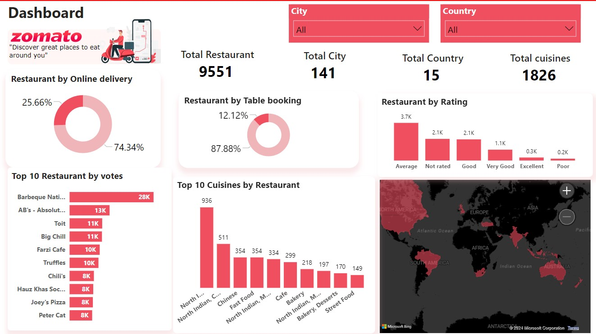

## Dashboard

*Example of the interactive dashboard showcasing key insights from the analysis.*

# Optimizing-User-Experience-Global-Dining-Trends-Analysis
Analyze global dining trends with Zomato data to enhance user experience. Includes data cleaning, exploratory analysis, and visualizations of restaurant ratings, cuisines, and price ranges. Discover insights to improve user engagement and support restaurant promotion.
